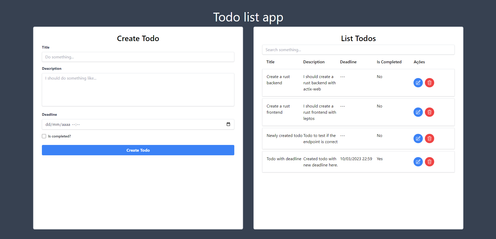

# Rust Todo List

## Introduction

I've always wanted to learn a low-level language. **Rust** caught my attention because of the hype around it and also its **robust type system**.

My main goal was to build an HTTP server and compare its performance with a basic **Node Express** app. I wanted to check how better a low-level language is compared to **Javascript**.

Within my research, I found **Actix** to be a good library to build APIs and started building a basic TODO app.

Along the way, I learned that there is a **Solid.js** like framework called **Leptos**, and it not only uses **WASM** (a concept I wanted to explore) but was developed in **Rust**. I was a perfect match.

Because of that, I created this repository to register my process of learning **Rust** and **WASM**.

### Server

The `./server` folder contains a backend that provides the basic CRUD for a TODO app. The current technologies I'm using are:

-   [Actix](https://actix.rs/docs/http2) for the backend API
-   [Serde](https://serde.rs/) for proficient JSON parsing
-   [Chrono](https://docs.rs/chrono/latest/chrono/) for handling dates

### Client

The `./client` folder contains a basic frontend that uses create_signal, create_effect, and create_memo to create a form and a list of todos.

-   [Leptos](https://github.com/leptos-rs/leptos) serves as the frontend framework
-   [Tailwindcss](https://tailwindcss.com/) contributes to the styling of the web page
